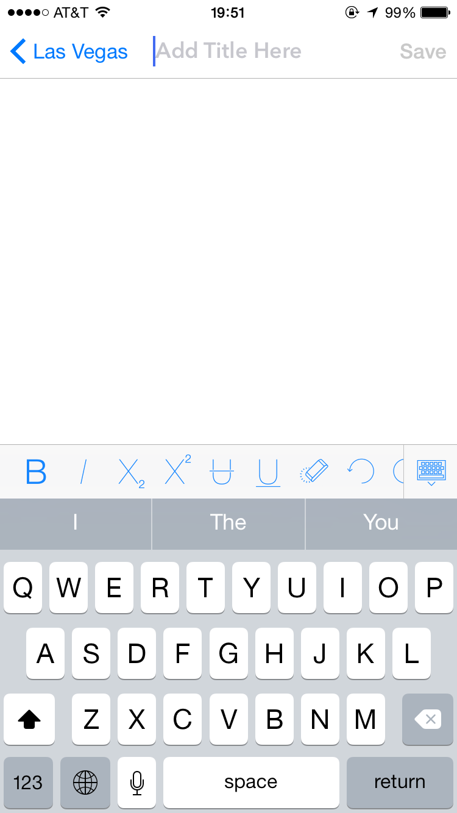

MyTrip(iOS Project)

-- Jiaxin Li(N15529957, jl6467@nyu.edu)

-- Tanmay Grover(N19401705, tg1305@nyu.edu)

It is a native iOS Application that allows us to build a diary of our trip. It will help us mark and record the   places we went along with a  small description and picture of the place we visited. There are other similar applications like  Diary, Instagram & Facebook.  However, My Trip is mainly based on one’s trip details, hence provides more richer and a compelling user experience�

###Jiaxin Li
- Trip Module
    - TripHistoryViewController
    - AddNewTripViewController
    - MenuViewController
    - EditEventViewController
    
- DataModel
    - Event Entity
    - Trip Entity

### Tanmay Grover
- Event Module
    - EventsListViewController
    - CurrentTripViewController
    - DisplayEventViewController
    - AboutViewController

- Custom TableViewCell
    - Event Cell
    - Trip Cell

